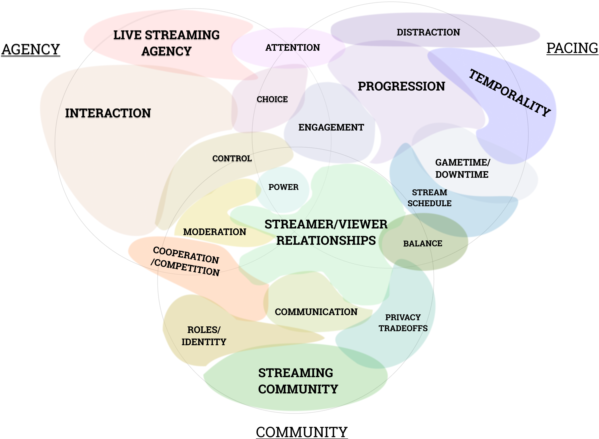

In the social-distancing era of COVID-19, live events, such as attending a conference or a lecture, are becoming more distributed. By this, we mean performers (e.g., instructors or paper presenters) and audiences (e.g., students or conference attendees) find themselves participating remotely in their homes or offices rather than in person. The once rich experience of sharing a live event through physical co-presence becomes one of potential isolation for both performers and audiences. Currently, event organizers employ commercial videoconferencing systems, such as Zoom, to host live events. However, these systems offer minimal functionality for creating the shared social experiences that constitute attending live events. Instead, performers find themselves talking to a "silent dark wall", while audiences with limited agency and minimal co-presence easily shift attention to other activities.

The HCI community is at a watershed moment. We find ourselves with an immediate need to design and develop new approaches for distributed live events that operate within the constraints of existing technologies while making use of novel interaction design to address challenges imposed by the lack of physical co-presence. We need to design for distributed liveness, taking into account not only aspects of physical co-presence but additionally forms of social co-presence afforded by varying degrees of audience participation and forms of spatial co-presence arising from the virtual and hybrid spaces that situate live experiences in shared environments. In recent years, we are seeing an increased interest within HCI and other disciplines to explore and map out design spaces of distributed liveness and audience participation. The objective of this workshop is to bring together interested practitioners and researchers to imagine and design new forms of distributed liveness, learn new methods to evaluate their designed experiences, and begin to realize a near future that will tear down the silent dark wall.

We view live streaming—an increasingly popular form of live media where performers or “streamers” broadcast to distributed audiences who then typically interact with the performer and others via a text chat—as a resource for understanding effective forms of distributed liveness and audience participation. Research suggests that deeply engaging live-stream viewers through audience participation has the power to create authentic social connections, turning "parasocial" (one-direction) interactions with performers into bidirectional social experiences, akin to "seeing friends". Through interaction, live streams can act as virtual "third places", communities with a multidimensional ecosystem of relationships between streamer and viewers. Such rich interaction has been shown to increase viewer attitudes toward live streams, and enhance their perceived value.

Workshop organizers Striner, Webb, and Cook developed a theme map of audience participation within game live
streaming on Twitch. The theme map visualizes relationships between core concepts of agency, pacing, and
community and their associated themes (above). We posit that this theme map provides a valuable tool for
reflecting upon and analyzing forms of distributed liveness, where audience agency gives rise to social and spatial
co-presence, temporal pacing influences experiences of liveness, and equitable participation in conjunction with shared
virtual and hybrid spaces enables community formation. Workshop participants will employ the theme map to discuss
overlaps and identify research gaps with regards to in distributed liveness.

This workshop invites practitioners and researchers to draw upon their experiences, approaches, and knowledge from the pandemic and submit artifacts describing existing methods that support distributed liveness or envisioning new forms that address social, spatial, and physical co-presence within distributed liveness. The objective of this workshop is to learn from one another’s experiences, connect and collaborate on ideas, and guide next steps for designing and studying distributed live experiences.